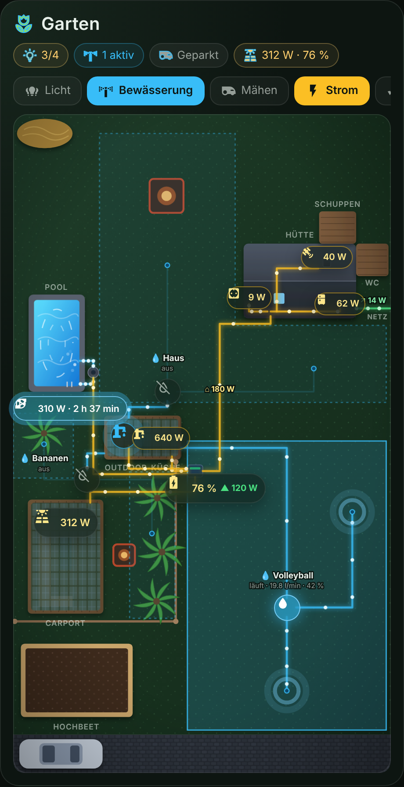
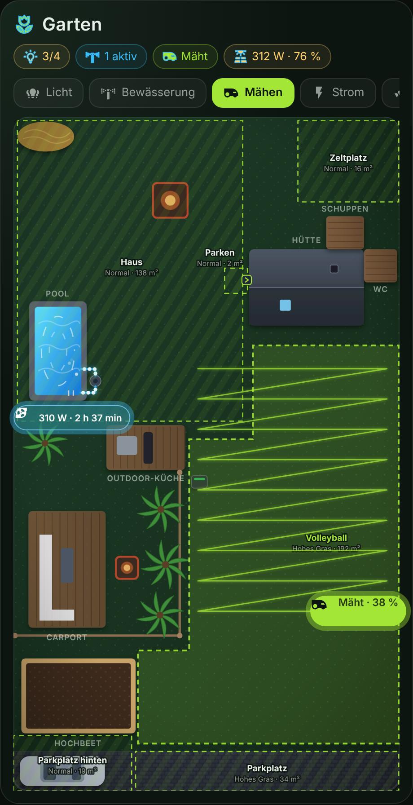

# 🌿 Garten Floor Plan Card

Eine moderne, interaktive Gartenkarte (Draufsicht) für Home Assistant im dunklen Glas-Design.
Lichter, Bewässerung, Mähzonen, Solar und Kameras werden direkt auf dem Grundriss angezeigt und lassen sich dort bedienen.

| Strom · Bewässerung | Mähen · Kameras |
|---|---|
|  |  |

## Funktionen

- **Ebenen-Chips**: Licht, Bewässerung, Mähen, Solar und Kameras lassen sich einzeln ein- und ausblenden.
- **Licht**: Lichterkette, Licht innen, Außensteckdose (Hütte), Outdoor-Küche und Carport. Ein Tipp schaltet um, langes Drücken öffnet die Details. Eingeschaltete Lichter leuchten in ihrer echten RGB-Farbe.
- **Bewässerung**: Rohrleitungen vom Hauswasserwerk zu den Ventilen und weiter zu den Sprinklern. Fließt Wasser, wandern Tropfen durch die Leitung, schneller bei mehr Durchfluss. Dazu kommen Durchfluss in l/min und Fortschritt in %.
- **Mähen**: Zonen wie in der Mäher-App (Haus, Zeltplatz, Volleyball inkl. Streifen und Ecke, Parken an der Ladestation, Parkplatz, Parkplatz hinten) mit Vermeidungsmodus und Fläche aus der Mäherkarte. Live-Position, Spur des aktuellen Mähvorgangs und die gerade gemähte Zone kommen aus `sensor.leopard_2_live_map`.
- **Strom**: Leitungen von den Solarpanels zur Anker Solix, von dort ins Hausnetz und zu den Verbrauchern (Hütte: Kühlschrank, Starlink, Außensteckdose; Hauswasserwerk; Poolpumpe) sowie Netzbezug und Einspeisung. Wandernde Punkte zeigen Richtung und Stärke, Watt-Werte stehen direkt dran. Die Akku-Anzeige zeigt Laden und Entladen.
- **Pool**: Läuft die Poolpumpe, zirkuliert das Wasser sichtbar, Blasen steigen an der Düse auf und die Filterleitung ist animiert.
- **Kameras**: Kamera-Pins öffnen das Live-Bild.
- **Kopfzeile**: Zusammenfassung mit Lichtern an, aktiven Ventilen, Mäherstatus sowie Solar-Leistung und Akku.
- Keine Abhängigkeiten, kein Build-Schritt, respektiert `prefers-reduced-motion`.

## Installation

### HACS (empfohlen)
1. HACS → ⋮ → **Benutzerdefinierte Repositories** → `https://github.com/passi277/ha-garten-floor-plan`, Typ **Dashboard**.
2. „Garten Floor Plan Card“ installieren und den Browser neu laden.

### Manuell
`garten-floor-plan-card.js` nach `/config/www/` kopieren und als Ressource hinzufügen:
```yaml
url: /local/garten-floor-plan-card.js
type: module
```

## Konfiguration

Minimal (alle Entitäten sind mit den Standardnamen vorbelegt):
```yaml
type: custom:garten-floor-plan-card
title: Garten
```

Vollständig:
```yaml
type: custom:garten-floor-plan-card
title: Garten
show_labels: true
layers: [lights, irrigation, mowing, solar, cameras]   # welche Chips es gibt
active_layers: [lights, irrigation]                    # beim Laden aktiv
mower_position: { x: 400, y: 292 }                     # Position des Mähers (Koordinaten 0–490 / 0–855)
entities:
  light_carport: light.carport_2
  light_kitchen: light.outdoor_kuche
  light_string: light.led_bulb_string_lights
  light_hut: switch.shelly_licht
  socket_hut: switch.shelly_hutte_ausensteckdosen_switch_0
  valve_haus: switch.ventil_haus
  valve_volleyball: switch.ventil_volleyball
  valve_bananen: switch.ventil_bananen
  progress_haus: sensor.bewasserung_haus_fortschritt
  progress_volleyball: sensor.bewasserung_volleyball_fortschritt
  progress_bananen: sensor.bewasserung_bananen_fortschritt
  pump: switch.stecker_pumpe_switch_0
  mower: lawn_mower.aussen_leopard_2
  solar_power: sensor.system_solix_garten_sb_solarleistung
  battery_soc: sensor.system_solix_garten_sb_ladestand
  pool_runtime: sensor.pool_laufzeit_formatiert
cameras:            # optional, ersetzt die Standardliste
  - { entity: camera.haus, x: 312, y: 180 }
  - { entity: camera.pool, x: 56, y: 226 }
mow_zones:          # optional, ersetzt die Standardliste
  - name: Zeltplatz
    select: select.aussen_leopard_2_zeltplatz_vermeidungsmodus
    points: [[361, 5], [489, 5], [489, 108], [361, 108]]
```

### Pop-ups

Ein Tipp auf ein Element öffnet ein Pop-up mit einer beliebigen Lovelace-Card. Langes Drücken öffnet weiterhin den Standard-Dialog von Home Assistant.
Ohne eigene Konfiguration gelten diese Standards: Lichter → `custom:ha-light-card` (falls installiert, sonst `tile`), Mäher → `custom:ha-mower-card`, Kameras → Live-Bild, Schalter → `tile`.

```yaml
popups:
  pool:                         # Variante mit eigenem Titel
    title: Smart Pool
    card:
      type: custom:ha-pool-card
      pump: switch.stecker_pool_neu
  pump:                         # oder direkt die Card-Konfiguration
    type: custom:ha-irrigation-card
    pump: switch.stecker_pumpe_switch_0
  valve_haus: false             # Pop-up abschalten → Standardverhalten
```

Mögliche Schlüssel: `light_string`, `light_hut`, `socket_hut`, `light_kitchen`, `light_carport`, `pump`, `valve_haus`, `valve_volleyball`, `valve_bananen`, `mower`, `solar`, `battery`, `pool`, `camera:<entity_id>` sowie die Objekte `hut`, `kitchen`, `carport`, `shed`, `raised_bed`. Objekte werden nur antippbar, wenn für sie ein Pop-up konfiguriert ist.
Mit `tap_action: toggle` wird global wieder direkt geschaltet statt ein Pop-up zu öffnen.

### Mäherkarte

Die Position des Mähers wird von Millimetern der Mäherkarte stückweise linear auf den Plan umgerechnet. Mit `map_points` lässt sich das feinjustieren:

```yaml
map_points:
  x: [[-13800, 0], [-1350, 283], [0, 296], [5450, 490]]
  y: [[8700, 0], [3400, 108], [-2850, 290], [-22550, 795], [-25750, 855]]
```

Das Koordinatensystem der Karte ist 490 × 855 Einheiten groß (links oben = 0/0, Parkplatz unten).

## Entwicklung / Vorschau

```bash
python3 -m http.server 8000
# http://localhost:8000/preview/index.html öffnen
```
Die Vorschau simuliert `hass` mit Beispielzuständen und hat Buttons, mit denen sich Mäher, Ventile, Pumpe usw. umschalten lassen.
